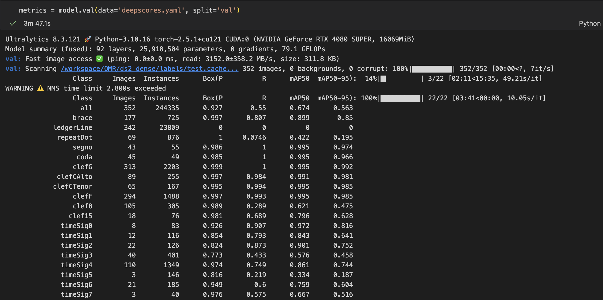
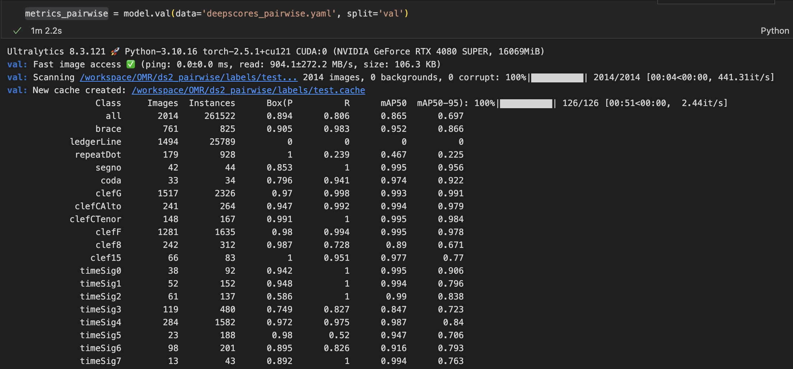
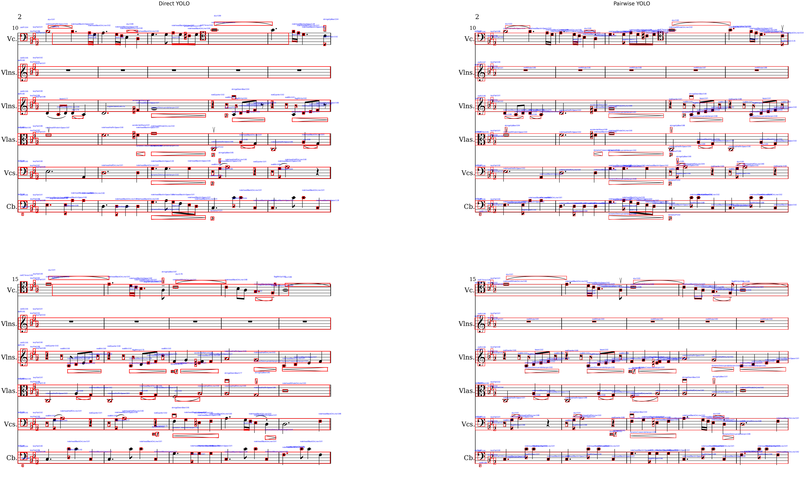
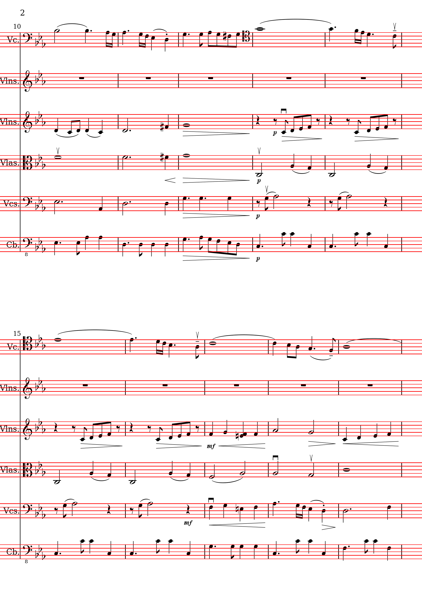

# Staff2Sound: A Deep Learning OMR Pipeline for Sheet Music to MIDI

**Staff2Sound** is an end-to-end deep learning pipeline that converts printed sheet music into playable MIDI files. Built on the DeepScoresV2 Dense dataset and powered by the YOLO object detection framework, our system detects musical symbols with high accuracy and reconstructs melodies through pitch analysis and symbolic interpretation.

To address the challenges of dense and small-object detection in sheet music, we introduce a **staffline-aware pairwise segmentation strategy**, significantly improving note recognition accuracy compared to direct detection. The final output is a valid `.mid` file playable by standard audio software.

This repository includes components for dataset preprocessing, model training and validation, staffline segmentation, and MIDI synthesis.

---
## Repository Structure

Below is a brief overview of the key folders and scripts in this repository:

### Directories
- `attachments/`: Stores visual result images like detection comparisons, validation plots, etc.
- `canon_samples/`: Contains example images from canon music sheets used for testing.
- `clean_models/`: (Optional) Contain YOLO pretrained model.
- `sheet_samples/`: Sample music sheets used for detection and visualization.
- `trained_models/`: Stores trained YOLOv8 model used for inference and validation.

### Core Scripts and Notebooks
- `prepare_ds2_for_yolo.ipynb`: Preprocesses the DeepScoresV2 Dense dataset to YOLO format.
- `yolo_train.py`: Trains the YOLOv8 model using the processed dataset.
- `yolo_validation.ipynb`: Runs full validation on the test set (direct or pairwise).
- `yolo_visualization.ipynb`: Visualizes predictions over multiple sheets.
- `staffline_detection.py`: Detects staff lines from grayscale images (used for segmentation).
- `yolo_to_midi.ipynb`: Converts YOLO detection results into a playable MIDI file.

### Development Helper scripts
- `midi_visualization.py`: Visualization of MIDI notes aligned with sheet images.
- `midi_to_sheet.py`: Helper for converting MIDI back to visual representations.

### YOLO Configurations
fix the path or use `prepare_ds2_for_yolo.ipynb` to auto generate
- `deepscores.yaml`: YOLO training config file for standard dataset.
- `deepscores_pairwise.yaml`: YOLO config tailored for pairwise cropped inputs.

---

## 1. Dataset Preparation

We use the **DeepScoresV2 Dense** dataset for training and evaluation.

- Official source: [Zenodo Record](https://zenodo.org/records/4012193)
- Backup copy: [Google Drive Folder](https://drive.google.com/drive/folders/1Fh5MDLxmB_od7o7MvaRp8b55Dn7dbvi0)

> 📦 **Note:** Please download and extract `ds2_dense.tar.gz` before proceeding.

### Preprocessing Instructions

Before training, you must clean and reformat the dataset to be compatible with YOLO:

- Annotations must be converted into YOLO format.
- Images and labels must be organized into `images/train`, `images/test`, `labels/train`, and `labels/test`.

Run the notebook `prepare_ds2_for_yolo.ipynb` to complete this step.

---

## 2. YOLO Model Training

The first stage in our OMR pipeline is training a YOLO model to detect music symbols.

To start training run:

```bash
python yolo_train.py
```
Your dataset folder (ds2_dense/) must contain:
- images/train/ and images/test/
- labels/train/ and labels/test/

Your OMR directory must have: 
- deepscores.yaml

If any of above files are missing, re-run `prepare_ds2_for_yolo.ipynb` before training.

## 3. YOLO Model Validation

After training a YOLO model, we proceed to perform **note detection** on music sheets.

### 3.1 Direct Validation

Initially, we applied the trained model directly to the entire music sheet without any pre-processing. However, the results were unsatisfactory: the **mAP@50 on the full DeepScores validation set was only around 67**.



This underperformance is expected. Dense object detection with many small and tightly packed symbols (like musical notes) is inherently challenging for YOLO and most general-purpose object detectors. 

### 3.2 Pairwise Staffline Detection Strategy

To address this, we implemented a more targeted detection strategy:
- We first **detect staff lines** and **split each sheet into staffline pairs (10-line segments)**.
- Each pair is then **cropped, resized, and individually processed** by YOLO.
- The results are stitched back to the full image space.

This approach leverages the local structure of music sheets and greatly simplifies the detection problem for the model. Here's the resulting performance:



We achieved a significant performance boost:  
**mAP@50 increased from 67 → 86.5**  
(using the exact same trained model as before)

### 3.3 Visual Comparison

Below is a side-by-side visualization of detection results using:
- **Left:** Direct inference on full sheet
- **Right:** Pairwise cropped inference



As seen, the **pairwise detection almost perfectly identifies notes** between the staff lines, far surpassing the direct detection baseline.

---

### 3.4 How to Validate

- To validate model performance on deepscore validation set:  
  **Run `yolo_validation.ipynb`**
  
- To visualize detection outputs across multiple images:  
  **Run `yolo_visualization.ipynb`**

## 4. Staffline Detection

In the previous section on pairwise detection, we mentioned that the image was segmented by **staffline pairs**. The foundation of this segmentation lies in **staffline detection** — accurately identifying horizontal lines on music sheets.

Our detection pipeline includes:
- Converting the image to grayscale
- Applying a 1D horizontal convolution filter
- Filtering based on pixel intensity and black-pixel ratio
- Grouping detected lines into sets of 5 (representing a staff)

This staffline information allows us to **segment the music sheet into cropped regions of interest**, improving both efficiency and detection accuracy.

Below is a sample of staffline_detection (without yolo prediction)


To directly see the detected stafflines overlaid on the original image, you can run:

```bash
python staffline_detection.py
```

## 5. YOLO to MIDI

The final step of our project is to **convert YOLO pairwise detection results into playable audio** — specifically, a `.midi` file.

We leverage the bounding box (bbox) outputs from YOLO to infer the **pitch and position** of each musical note. This conversion combines:
- The vertical position of each notehead relative to detected stafflines
- Knowledge of pitch mapping in a standard C major scale
- Temporal ordering based on horizontal (x-axis) location

Due to our limited expertise in music theory, we spent considerable time refining this component. Our current implementation is:
- **Restricted to C major**
- **Designed for one pairwise segment at a time**
- Capable of producing musically valid MIDI files for most staffline pairs


To generate a new MIDI file from detection results:

**Run `yolo_to_midi.ipynb`**

## 6. Limitations and Future Work

While the current implementation is functional, we recognize its limitations:
- It doesn't yet handle full-page sheet music end-to-end
- Time signatures and note durations are heuristically inferred
- Multi-staff instruments (e.g., piano left/right hand) are not yet distinguished

We plan to expand this module to:
- Support **full-sheet music conversion**
- Generalize to **multiple keys and clefs**
- Improve rhythm extraction and barline handling

Despite these constraints, we believe this is **a matter of iteration** and not a fundamental limitation of our method.

